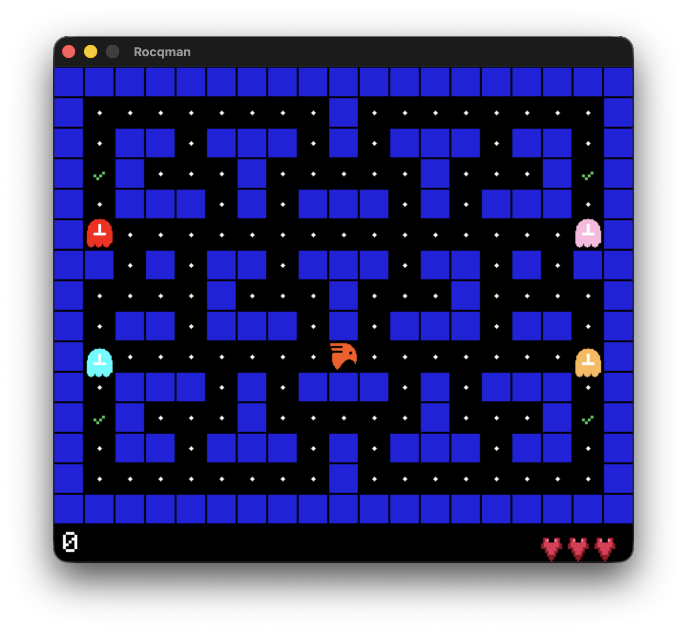

# Rocqman

Rocqman is a Pacman-like game written in Rocq and extracted to C++ with [Crane](https://github.com/bloomberg/crane). The game uses the separate `rocq-crane-sdl2` bindings submodule for SDL2 rendering, SDL2_image texture loading, SDL2_mixer audio playback, and itree-based effectful functions.
This establishes, at least informally, that Rocq is [Pacman-complete](https://corecursive.com/006-type-driven-development-and-idris-with-edwin-brady/#being-pacman-complete---0923---).



## Features

- game logic written in Rocq
- extraction to C++ with Crane
- SDL2 rendering
- smooth sprite interpolation
- sound effects for dots, power pellets, ghost kills, losing a life, game over, and victory

## Requirements

You need:

- Rocq with `dune`
- a C++23 compiler
- `pkg-config`
- SDL2
- SDL2_image
- SDL2_mixer

## Getting started

Clone the repo with everything it needs:

```bash
git clone --recurse-submodules https://github.com/joom/rocqman.git
cd rocqman
```

If you already cloned it without submodules, run:

```bash
git submodule update --init --recursive
```

## Installing dependencies

### macOS

Install the SDL packages with Homebrew:

```bash
brew install sdl2 sdl2_image sdl2_mixer
```

If you want to use Homebrew LLVM instead of the system toolchain:

```bash
brew install llvm
```

### Linux

The exact package names vary by distribution, but you generally need:

```bash
sudo apt install clang pkg-config libsdl2-dev libsdl2-image-dev libsdl2-mixer-dev
```

## Building

Build the game:

```bash
make
```

This does four things:

1. uses the local Crane checkout in `./crane`
2. builds and installs the local [`rocq-crane-sdl2`](./rocq-crane-sdl2) submodule
3. extracts [`theories/Rocqman.v`](./theories/Rocqman.v) to C++
4. copies the generated C++ into `src/generated/`
5. compiles the final executable `./rocqman`

Build with a different optimization level:

```bash
make OPT=-O2
```

## Running

Run the game:

```bash
make run
```

or:

```bash
./rocqman
```

Controls:

- arrow keys or `WASD`: move
- `Space`: pause or unpause
- `Q` or `Esc`: quit

## Cleaning

Remove build outputs:

```bash
make clean
```

This removes:

- `./rocqman`
- `./src/generated/`
- `./rocqman.dSYM`
- Dune build outputs

## Repository structure

```text
.
├── assets/
│   ├── *.mp3           sound effects
│   └── rocq.svg        player sprite
├── crane/              Crane submodule used for extraction
├── rocq-crane-sdl2/    SDL2 bindings submodule used by extraction
├── theories/
│   ├── Rocqman.v       game logic, rendering, extracted main
│   ├── RocqmanProofs.v proofs about gameplay transitions and control flow
│   └── dune            Rocq theory stanza
├── Makefile            extraction and native build entrypoint
├── dune-project        Dune project file
└── README.md
```

Generated files are written to:

```text
src/generated/
```

These are build artifacts and should not be edited manually.

## What Is Proved

The file [`theories/RocqmanProofs.v`](./theories/RocqmanProofs.v) contains machine-checked proofs about the current game logic. At the moment, those proofs show that the pure gameplay transitions used by the frame loop preserve key monotonicity properties: score never decreases, lives never increase, and the number of collectibles left never increases. It also proves that terminal logical states are fixed points of [`tick`](./theories/Rocqman.v), that paused gameplay stays paused until space is pressed, that pressing space while paused returns to `Playing`, and that `WinScreen` and `GameOverScreen` eventually request quit once enough time has elapsed.

## Development notes

- The authoritative game logic lives in Rocq, not in the generated C++.
- The build expects Crane at [`crane/`](./crane).
- The build expects the SDL bindings submodule at [`rocq-crane-sdl2/`](./rocq-crane-sdl2).
- Rocqman imports [`CraneSDL2`](./rocq-crane-sdl2) directly and runs its game loop as `itree sdlE`.
- The extracted program defines its own `main`, so there is no separate handwritten `main.cpp`.
